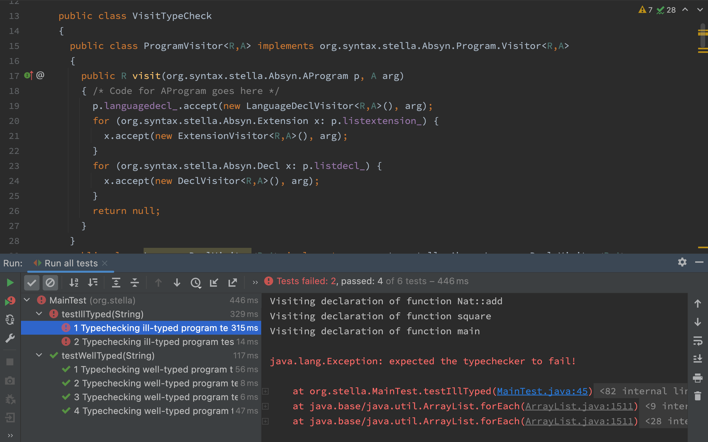

# stella-implementation-in-java

Template for an implementation of [Stella](https://fizruk.github.io/stella/) in Java.

The template contains:
1. [`Stella.cf`](Stella.cf) — LBNF for Stella (can be used by [BNF Converter tool](https://bnfc.digitalgrammars.com));
2. [`stellaLexer.g4`](src/main/java/org/syntax/stella/stellaLexer.g4) and [`stellaParser.g4`](src/main/java/org/syntax/stella/stellaParser.g4) — grammar files for [ANTLRv4 tool](https://www.antlr.org) (generated by BNF Converter);
3. [`org.syntax.stella.Absyn.*`](src/main/java/org/syntax/stella/Absyn/) — classes for the abstract syntax of Stella (generated by BNF Converter);
4. [`org.syntax.stella.VisitSkel`](src/main/java/org/syntax/stella/VisitSkel.java) — skeleton for a Visitor walking through an abstract syntax tree;
5. [`org.stella.eval.Eval`](src/main/java/org/stella/eval/Eval.java) — placeholder for the evaluator for Stella;
6. [`org.stella.typecheck.TypeCheck`](src/main/java/org/stella/typecheck/TypeCheck.java) — the typechecker for Stella;
7. [`org.stella.typecheck.VisitTypeCheck`](src/main/java/org/stella/typecheck/VisitTypeCheck.java) — the typechecking visitor for Stella's AST;
8. [`org.stella.Main`](src/main/java/org/stella/Main.java) — entry point for the Stella typechecker/interpreter;
9. [`org.stella.MainTest`](src/test/java/org/stella/MainTest) — some tests for the typechecker.

When implementing a typechecker, you should write your code primarily in [`org.stella.typecheck.VisitTypeCheck`](src/main/java/org/stella/typecheck/VisitTypeCheck.java).
